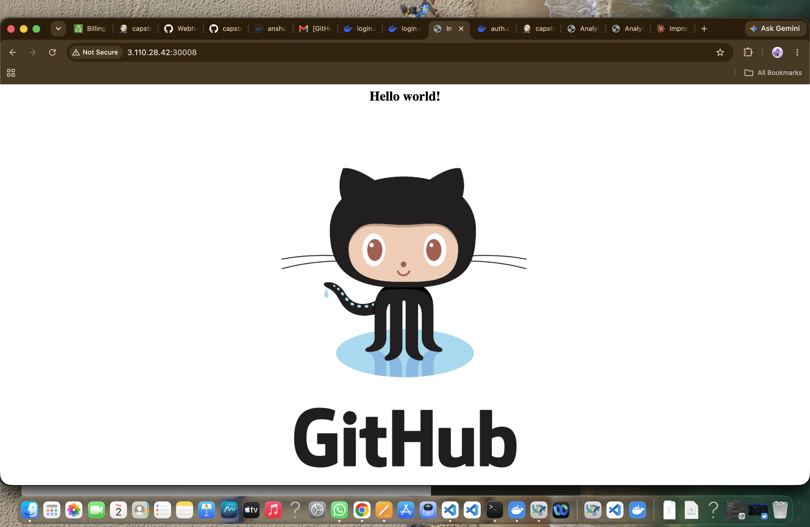
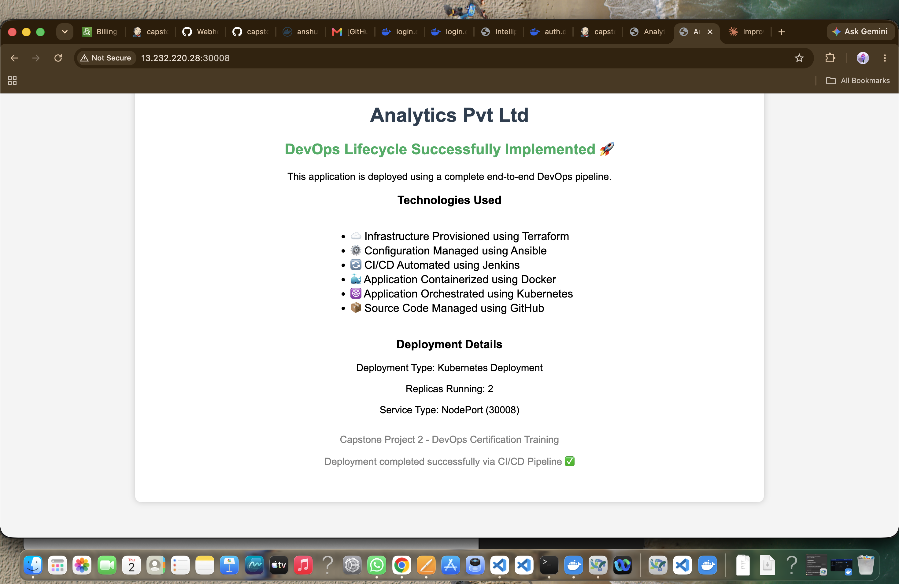

# 🚀 Capstone Project 2 — End-to-End DevOps Lifecycle Automation

<p align="center">
  
  
  
  
  
  
</p>

<p align="center">
  <b>A fully automated, production-style software delivery pipeline — from a single <code>git push</code> to a live application running on Kubernetes.</b>
</p>

<table align="center">
  <tr>
    <th align="center">🔴 Before (initial deploy)</th>
    <th align="center">🟢 After (auto-redeployed via pipeline)</th>
  </tr>
  <tr>
    <td></td>
    <td></td>
  </tr>
</table>
<p align="center"><i>Proof the pipeline works end-to-end: a code change pushed to GitHub was automatically built, pushed to Docker Hub, and rolled out to Kubernetes — no manual deployment steps.</i></p>

---

## 📖 Table of Contents

- [Project Overview](#-project-overview)
- [Project Objective](#-project-objective)
- [Architecture Overview](#-architecture-overview)
- [Technology Stack](#-technology-stack)
- [Infrastructure Provisioning](#-infrastructure-provisioning-using-terraform)
- [Configuration Management](#-configuration-management-using-ansible)
- [Jenkins CI/CD Pipeline](#-jenkins-cicd-pipeline)
- [Docker Implementation](#-docker-implementation)
- [Kubernetes Implementation](#-kubernetes-implementation)
- [Validation Performed](#-validation-performed)
- [Challenges and Solutions](#-challenges-and-solutions)
- [Repository Structure](#-repository-structure)
- [Final Result](#-final-result)

---

## 📌 Project Overview

This project demonstrates the implementation of a **complete DevOps lifecycle** using industry-standard tools and practices. The objective was to automate the entire software delivery process — starting from **infrastructure provisioning** to **application deployment on Kubernetes** — using **CI/CD pipelines**.

The project follows a real-world production workflow where:
- Infrastructure is provisioned automatically
- Servers are configured using automation tools
- Applications are containerized
- Deployments are managed through Kubernetes orchestration

The entire pipeline is integrated with **GitHub** and **Jenkins** to achieve Continuous Integration and Continuous Deployment (CI/CD).

<!-- 📸 SUGGESTED: Screenshot of the final deployed app in a browser -->

---

## 🎯 Project Objective

| # | Objective |
|---|-----------|
| 1 | Provision cloud infrastructure automatically |
| 2 | Configure servers without manual intervention |
| 3 | Build and deploy Docker containers automatically |
| 4 | Implement CI/CD using Jenkins |
| 5 | Manage application deployments using Kubernetes |
| 6 | Automate software delivery from GitHub push to production deployment |

---

## 🏗️ Architecture Overview

```text
Developer
    │
    ▼
GitHub Repository
    │
    ▼
GitHub Webhook Trigger
    │
    ▼
Jenkins Pipeline
    │
    ├── Source Code Checkout
    ├── Docker Image Build
    ├── Docker Image Push
    └── Kubernetes Deployment Update
    │
    ▼
Docker Hub Registry
    │
    ▼
Kubernetes Cluster
    │
    ├── Master Node
    ├── Worker Node 1
    └── Worker Node 2
    │
    ▼
NodePort Service
    │
    ▼
End Users Access Application
```

<!--
  📸 SUGGESTED: Replace the text diagram above (or supplement it) with a
  proper architecture diagram image:
  <p align="center"></p>
-->

---

## 🛠️ Technology Stack

| Category | Tools |
|---|---|
| **Cloud Provider** | AWS |
| **Infrastructure as Code** | Terraform |
| **Configuration Management** | Ansible |
| **CI/CD** | Jenkins |
| **Containerization** | Docker, Docker Hub |
| **Orchestration** | Kubernetes |
| **Version Control** | Git & GitHub |
| **Web Server** | Nginx |

---

## ☁️ Infrastructure Provisioning using Terraform

**EC2 Instances Provisioned:**

| Instance Name | Role |
|---|---|
| `worker1-jenkins` | Jenkins Server |
| `worker2-k8s` | Kubernetes Worker Node |
| `worker3-master` | Kubernetes Master Node |
| `worker4-k8s` | Kubernetes Worker Node |

**Total EC2 Instances:** `4`

<!-- 📸 SUGGESTED: Screenshot of `terraform apply` output / AWS EC2 console showing running instances -->

---

## ⚙️ Configuration Management using Ansible

Automated tasks handled by Ansible playbooks:
- ✅ Java installation
- ✅ Jenkins installation
- ✅ Docker installation
- ✅ Kubernetes installation
- ✅ Cluster configuration

<!-- 📸 SUGGESTED: Screenshot of a successful `ansible-playbook` run -->

---

## 🔄 Jenkins CI/CD Pipeline

**Pipeline Stages:**

1. 🔽 Source Code Checkout
2. 🐳 Docker Image Build
3. 📤 Docker Image Push
4. ☸️ Kubernetes Deployment
5. ✅ Deployment Verification

<!-- 📸 SUGGESTED: Screenshot of the Jenkins pipeline stage view (green stages) -->

---

## 🐳 Docker Implementation

- **Repository:** `anshu9103/capstone-website`
- **Image Tagging Strategy:** `anshu9103/capstone-website:${BUILD_NUMBER}`

<!-- 📸 SUGGESTED: Screenshot of Docker Hub repository showing pushed image tags -->

---

## ☸️ Kubernetes Implementation

| Component | Detail |
|---|---|
| Master Nodes | 1 |
| Worker Nodes | 2 |
| Application Replicas | 2 |
| Service Type | NodePort |
| Exposed Port | `30008` |

<!-- 📸 SUGGESTED: Screenshot of `kubectl get pods,svc,nodes -o wide` output -->

---

## ✅ Validation Performed

- [x] Terraform infrastructure provisioning
- [x] Ansible automation
- [x] Jenkins pipeline execution
- [x] Docker image build and push
- [x] Kubernetes deployment rollout
- [x] Application accessibility through NodePort — see before/after screenshots above
- [x] GitHub webhook trigger

---

## 🧩 Challenges and Solutions

<details>
<summary><b>❌ Jenkins Failed to Start</b></summary>

- **Cause:** Java 17 installed while Jenkins required Java 21.
- **Fix:** Installed OpenJDK 21.
</details>

<details>
<summary><b>❌ Docker Push Failed</b></summary>

- **Cause:** Jenkins user not authenticated to Docker Hub.
- **Fix:** Performed Docker login as Jenkins user.
</details>

<details>
<summary><b>❌ ImagePullBackOff</b></summary>

- **Cause:** ARM image compatibility issues.
- **Fix:** Rebuilt and pushed compatible images.
</details>

<details>
<summary><b>❌ GitHub Push Failed</b></summary>

- **Cause:** <code>.terraform</code> files exceeded GitHub size limits.
- **Fix:** Added <code>.terraform</code> and state files to <code>.gitignore</code>.
</details>

<details>
<summary><b>❌ Kubernetes API Connection Refused</b></summary>

- **Cause:** Control plane services restarting during initialization.
- **Fix:** Verified and stabilized control plane components.
</details>

<details>
<summary><b>❌ Calico CrashLoopBackOff</b></summary>

- **Cause:** Containerd cgroup mismatch.
- **Fix:** Enabled <code>SystemdCgroup=true</code>.
</details>

---

## 📁 Repository Structure

```text
capstone-project-2-devops-lifecycle/
│
├── terraform/
├── ansible/
├── docker/
├── kubernetes/
├── Jenkinsfile
├── README.md
└── capstone-project-2.pdf
```

---

## 🏁 Final Result

| Stage | Status |
|---|---|
| Infrastructure Provisioned with Terraform | ✅ |
| Configuration Managed with Ansible | ✅ |
| CI/CD Automated with Jenkins | ✅ |
| Application Containerized with Docker | ✅ |
| Application Orchestrated with Kubernetes | ✅ |
| Production Deployment Successfully Completed | ✅ |

<p align="center">
  <b>🚀 End-to-End DevOps Lifecycle Successfully Implemented 🚀</b>
</p>